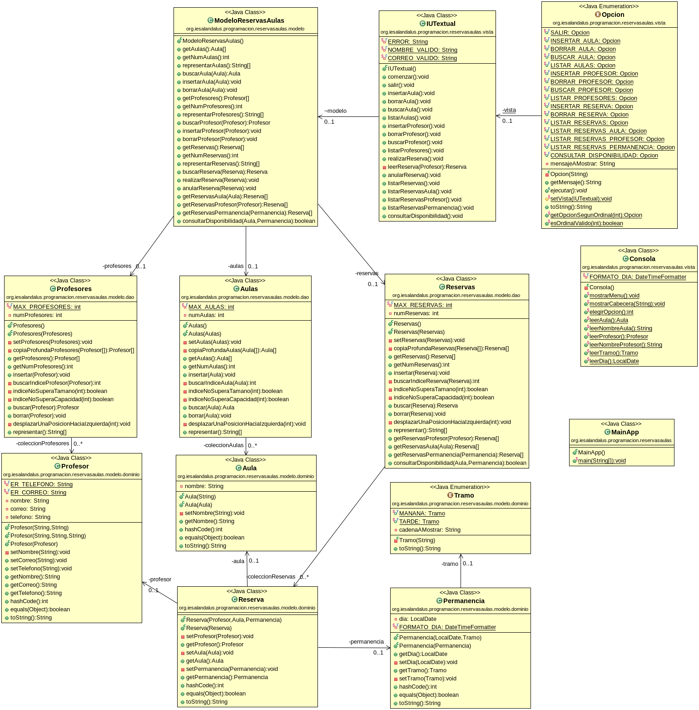

# Tarea Reservas de Aulas
## Profesor: José Ramón Jiménez Reyes
## Alumno: Jes˙s Salazar Fenoy

La tarea va a consistir en modelar la gestión de reservas de aulas del IES Al-Ándalus. Después de todas las especificaciones y requerimientos anotados, en ese primer spring de la aplicación se ha decidido abarcar los siguientes:

- Hay unas aulas que se pueden reservar, aunque en este primer spring sólo contemplaremos la reserva del salón de actos. Por tanto, un **aula** será identificada por su **nombre**, el cuál no puede estar vacío y tampoco se puede modificar dicho nombre una vez creada. Podremos crear nuevas aulas (siempre que no exista otra aula con el mismo nombre), borrarlas, buscar aulas por su nombre y listar las aulas.
- Los profesores podrán realizar reservas. Un **profesor** se identifica por su **nombre**, su **correo electrónico** (que debe ser correcto) y su **teléfono**. El teléfono puede proporcionarlo el profesor o no. Si lo indica será una cadena de 9 dígitos y siempre debe comenzar por 6 o 9. Si no lo indica, no se asociará ningún teléfono a dicho profesor. Una vez creado un profesor no se le podrá cambiar el nombre, pero sí se podrá cambiar su correo o su teléfono, pudiendo ser este último vacío. Podremos añadir nuevos profesores (siempre que no exista otro profesor con el mismo nombre), borrarlos, buscar profesores por su nombre y listar los profesores dados de alta.
- Como en este primer spring sólo contemplamos la reserva del salón de actos, éste se podrá reservar para una **permanencia** de un **día** y para el **tramo** de mañana o tarde.
- Un **profesor** podrá **reservar** un **aula** para una **permanencia** dada. No se llevará a cabo la reserva si para dicha permanencia y aula ya hay otra reserva dada de alta. También podremos anular una reserva, buscar una reserva para un aula  permanencia dada y listar todas las reservas existentes. También podremos listar las reservas que ha realizado un profesor, listar las reservas de un aula dada y listar las reservas para una permanencia concreta. Cómo no, también podremos consultar la disponibilidad de un aula para una permanencia dada.

Tu tarea consiste en realizar una aplicación para gestionar la reserva de aulas para el IES Al-Ándalus. Con los conocimientos adquiridos hasta el momento realizaremos una implementación basada en arrays para gestionar las colecciones. Aunque aún no tenemos los conocimientos necesarios para aplicar el patrón MVC, sí haremos una distinción entre la vista (encargada de interaccionar con el usuario) y el modelo (encargado de gestionar los datos) que dividiremos entre clases del dominio y las clases DAO que nos permiten interactuar con las colecciones.

Debes tener en cuenta el problema existente con las referencias, por lo que para cada clase que sea cliente de otra deberás devolver referencias a objetos nuevos en los métodos de acceso y también crear nuevas referencias a nuevos objetos cuando los vayamos a asignar a atributos. En los métodos de las clases DAO también deberás devolver una copia profunda de los elementos de la colección en dicho método de acceso.

También siempre se deben validar todas los valores que se intentan asignar y si no lanzar una excepción adecuada para evitar inconsistencias en el estado de los objetos.

Para ello te pongo un diagrama de clases para el mismo y poco a poco te iré explicando los diferentes pasos a realizar:

He subido a GitHub un esqueleto de proyecto gradle que ya lleva incluidos todos los test necesarios que el programa debe pasar. Dichos test est√°n todos comentados y deber√°s ir descoment√°ndolos conforme vayas avanzando con la tarea. La URL del repositorio es en la que te encuentras.

Por tanto, tu tarea va a consistir en completar los siguientes apartados:

1. Lo primero que debes hacer es realizar un **fork** del repositorio donde he colocado el proyecto gradle con la estructura del proyecto y todos los test necesarios.
2. Clona tu repositorio remoto recién copiado en github a un repositorio local que será donde irás realizando lo que a continuación se te pide. Añade tu nombre al fichero `README.md` en el apartado "Alumno". Haz tu primer commit.
3. Crea el enumerado `Tramo` con las siguientes constantes: `MANANA` y `TARDE`, en este orden. Haz un commit.
4. Crea la clase `Permanencia` con sus atributos especificados, los métodos de acceso y modificación con su visibilidad adecuada y el constructor con dos parámetros y copia tal y como se indica en el diagrama de clases. El formato de un día debe ser "dd/mm/aaaa".  Crea también los métodos `equals`, `hashCode` y `toString`, teniendo en cuenta que dos permanencias serán iguales si son para el mismo día y para el mismo tramo. Haz un commit.
5. Crea la clase `Aula` con los atributos indicados, los métodos de acceso y modificación con su visibilidad adecuada y el constructor con un parámetro y copia tal y como se indica en el diagrama de clases. Crea también los métodos `equals`, `hashCode` y `toString`, teniendo en cuenta que dos aulas serán iguales si sus nombres son los mismos. Haz un commit.
6. Crea la clase `Profesor` con los atributos indicados, los métodos de acceso y modificación con su visibilidad adecuada y el constructor con dos o tres parámetros y el constructor copia. Crea también los métodos `equals`, `hashCode` y `toString`, teniendo en cuenta que dos profesores serán iguales si su nombre es el mismo. Haz un commit.
7. Crea la clase `Reserva` con los atributos indicados, los métodos de acceso y modificación con su visibilidad adecuada y el constructor con tres parámetros y copia tal y como se indica en el diagrama de clases. Crea también los métodos `equals`, `hashCode` y `toString`, teniendo en cuenta que dos reservas serán iguales si el aula y la permanencia son iguales, independientemente del profesor. Haz un commit.
8. Crea la clase `Aulas` con los atributos indicados, los métodos de acceso y modificación con su visibilidad adecuada y el constructor por defecto y copia. Crea los métodos `insertar`, `buscar`, `borrar` y `representar` apoyándote en los métodos privados que se exponen en el diagrama de clases. Haz un commit.
9. Crea la clase `Profesores` con los atributos indicados, los métodos de acceso y modificación con su visibilidad adecuada y el constructor por defecto y copia. Crea los métodos `insertar`, `buscar`, `borrar` y `representar` apoyándote en los métodos privados que se exponen en el diagrama de clases. Haz un commit.
10. Crea la clase `Reservas` con los atributos indicados, los métodos de acceso y modificación con su visibilidad adecuada y el constructor por defecto y copia. Crea los métodos `insertar`, `buscar`, `borrar`, `representar`, `getReservasAula`, `getReservasProfesor`, `getReservasPermanencia` y `consultarDisponibilidad` apoyándote en los métodos privados que se exponen en el diagrama de clases. Haz un commit.
11. Crea la clase `ModeloReservasAulas` con los atributos indicados, los métodos que se especifican en el diagrama y que simplemente llamarán a cada uno de los métodos de la clase DAO implicada. Haz un commit.
12. Crea el enumerado `Opcion` que será el encargado de representar el menú de opciones de nuestra aplicación y que se adecue al diagrama de clases expuesto. Haz un commit.
13. Crea la clase `Consola` de ayuda, que ser√° la encargada de realizar las diferentes lecturas de los objetos desde la consola. Recuerda evitar que se cree el constructor por defecto. Haz un commit.
14. Crea la clase `IUTextual` con los métodos que se especifican y que será la encargada de ejecutar cada una de las opciones del menú de nuestra aplicación. Haz un commit.
15. Crea una clase llamada `MainApp` que incluya un método `main`. El método `main` deberá mostrarnos un menú con las diferentes opciones y actuar en consecuencia. El menú se repetirá mientras no elijamos la opción salir. Haz un commit.

###### Se valorar√°:
- La nomenclatura del repositorio de GitHub y del archivo entregado sigue las indicaciones de entrega.
- La indentación debe ser correcta en cada uno de los apartados.
- El nombre de las variables debe ser adecuado.
- Se debe utilizar la clase `Entrada` para realizar la entrada por teclado.
- El proyecto debe pasar todas las pruebas que van en el esqueleto del mismo y toda entrada del programa será validada para evitar que el programa termine abruptamente debido a una excepción.
- Se deben utilizar los comentarios adecuados.
- Se valorará la corrección ortográfica tanto en los comentarios como en los mensajes que se muestren al usuario.

